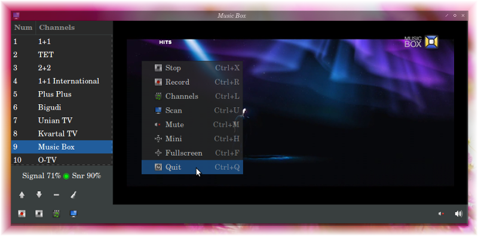

Gtv-Dvb   1.0 stable
-------

* Digital TV player
* DVB-T/T2, DVB-S/S2, DVB-C

Preview
------------

* OS Lubuntu; Icon-theme [Light-media](https://github.com/vl-nix/light-media); Theme [Adwaita-dark](https://github.com/GNOME/gnome-themes-standard)

* OS AltLinux; Icon-theme default; Theme [Adwaita-dark](https://github.com/GNOME/gnome-themes-standard)

Requirements
------------

* Graphical interfaces - [Gtk+3](https://developer.gnome.org/gtk3)
* Audio & Video & Digital TV - [Gstreamer 1.0](https://gstreamer.freedesktop.org)

License
-------

* [GNU Lesser General Public License](http://www.gnu.org/licenses/lgpl.html)

Depends
-------

* gcc
* gtk+3
* gstreamer
* gst-plugins-base
* gst-plugins-good
* gst-plugins-ugly
* gst-plugins-bad
* gst-libav

Makefile
--------

* make [target]:
  * help
  * info
  * install
  * uninstall
  * ...

Channels
--------

* Scan channels manually ( Ctrl + U )
* Convert - dvb_channel.conf ( format [DVBv5](https://www.linuxtv.org/docs/libdvbv5/index.html) )
 
* dvb_channel.conf - created by command: [dvbv5-scan](https://www.linuxtv.org/downloads/v4l-utils) [OPTION...] [initial file](https://www.linuxtv.org/downloads/dtv-scan-tables)

Record
------

* Encoder
* Ts

Design
------
* Icon-theme [Light-media](https://github.com/vl-nix/light-media)

* Theme [Adwaita-dark](https://github.com/GNOME/gnome-themes-standard)

