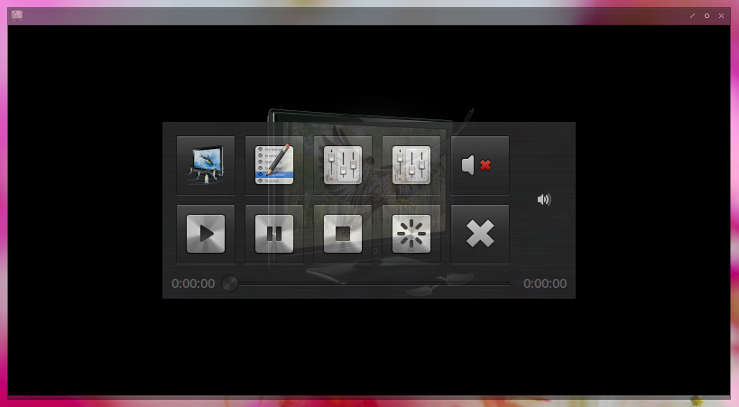
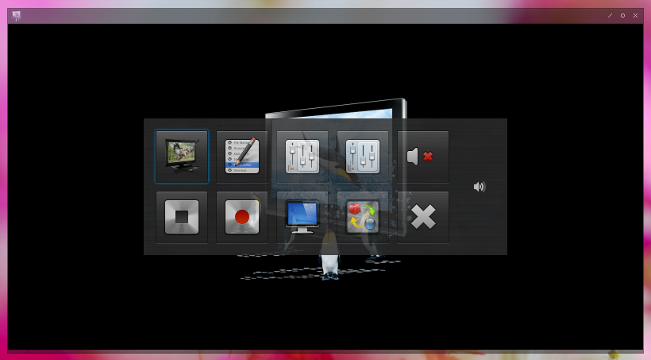
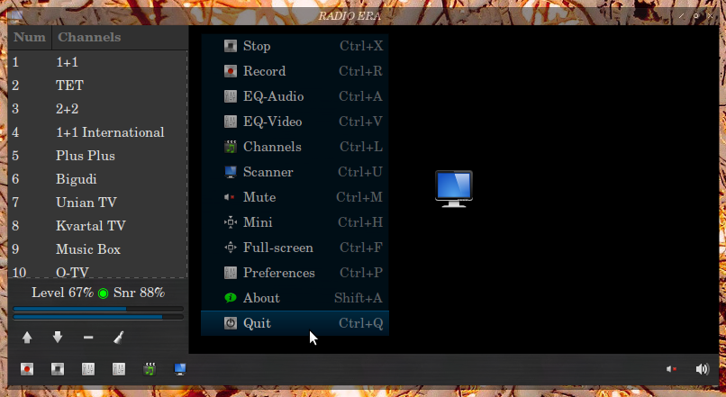

[Gtv-Dvb](https://github.com/vl-nix/gtv-dvb)
-------

* Media Player & Digital TV
* DVB-T2/S2/C, ATSC, DTMB
* Ver. Classic Stable  [1.1.9](https://github.com/vl-nix/gtv-dvb/releases/tag/1.1.9)
* Ver. Modern  Stable  [2.0](https://github.com/vl-nix/gtv-dvb/releases/tag/2.0)

[Modern Media Player](https://github.com/vl-nix/gtv-dvb/tree/modern)
------------

[Modern Digital TV](https://github.com/vl-nix/gtv-dvb/tree/modern)
------------

[Classic Digital TV](https://github.com/vl-nix/gtv-dvb/tree/classic)
------------

Requirements
------------

* Graphical user interface - [Gtk+3](https://developer.gnome.org/gtk3)
* Audio & Video & Digital TV - [Gstreamer 1.0](https://gstreamer.freedesktop.org)
* [GNU Lesser General Public License](http://www.gnu.org/licenses/lgpl.html)

Depends
-------

* gcc
* make
* gettext
* libgtk 3 ( & dev )
* gstreamer 1.0 ( & dev )
* gst-plugins 1.0 ( & dev )
  * base, good, ugly, bad ( & dev )
* gst-libav

DEB
* libgtk-3-0 gstreamer1.0-x
* gstreamer1.0-plugins-base gstreamer1.0-plugins-good
* gstreamer1.0-plugins-bad gstreamer1.0-plugins-ugly gstreamer1.0-libav

RPM
* libgtk+3 gstreamer1.0
* gst-plugins-base1.0 gst-plugins-good1.0
* gst-plugins-bad1.0 gst-plugins-ugly1.0 gst-libav

Makefile
--------

* make [target]:
  * help
  * info
  * ...

Drag and Drop
-------------
  * folders
  * files
  * playlists - [M3U](https://ru.wikipedia.org/wiki/M3U)

Channels
--------

* Scan channels manually
* Convert - dvb_channel.conf ( format [DVBv5](https://www.linuxtv.org/docs/libdvbv5/index.html) ) 
  * dvb_channel.conf - created by command: [dvbv5-scan](https://www.linuxtv.org/downloads/v4l-utils) [OPTION...] [initial file](https://www.linuxtv.org/downloads/dtv-scan-tables)

Design
------

* Dark Theme
