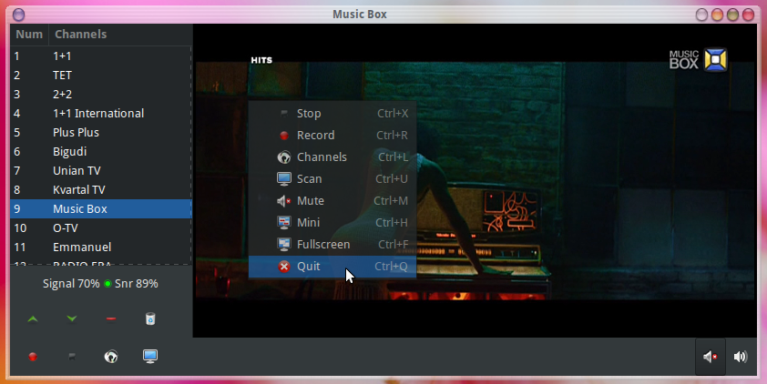

## GTV 1.0

	Digital TV player
	DVB-T/T2, DVB-S/S2, DVB-C

### Requirements:
	Graphical interfaces - Gtk+3
	Audio & Video & Digital TV - Gstreamer 1.0

### License:
	GNU LESSER GENERAL PUBLIC LICENSE
	http://www.gnu.org/licenses/lgpl.html

### Depends:
	gtk+3, gstreamer, gst-plugins-base, gst-plugins-good, gst-plugins-ugly, gst-plugins-bad, gst-libav

### Compile:
	sh scripts/compile.sh
  
### Install ( home ):
  	sh scripts/install-home.sh

### Uninstall ( home ):
	sh scripts/uninstall-home.sh

### Channels:
	1. Scan channels manually ( Ctrl + U ).
	2. Convert - dvb_channel.conf ( format DVBv5 ).
	
	dvb_channel.conf - created by command: dvbv5-scan [OPTION...] <initial file>

	dvbv5-scan - https://www.linuxtv.org/downloads/v4l-utils/
	initial file - https://www.linuxtv.org/downloads/dtv-scan-tables/

### Record:
	the default video theoraenc, vorbisenc audio ( these settings can be changed )

[Markdown](http://en.wikipedia.com/wiki/Markdown)
[dvbv5-scan](httphttps://www.linuxtv.org/downloads/v4l-utils)
